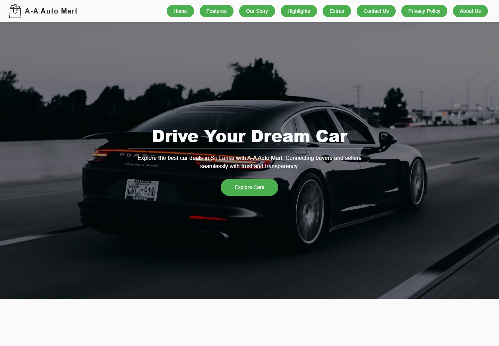

# A-A Auto Mart Car Sale

Our A-A Auto Mart Car Sale project is a full-stack MERN application for managing vehicle sales, vehicle parts, mechanic work, orders, payments, employees, users, reviews, and customer support.

We organized the project as one integrated final application with a Node/Express backend, a React/Vite frontend, and MongoDB as the database.

## Landing Page Preview



## Project Documentation

- [UI Screenshots](./docs/A_A_Auto_Mart_UI_Screenshots.pdf)
- [Project Report](./docs/A_A_Auto_Mart_Project_Report.pdf)

The project report PDF includes the project overview, technology stack, and contribution details. The UI screenshots PDF includes the module screens and visual project walkthrough. This README includes the repository structure, framework details, setup instructions, branch information, and security notes.

## Features

- User management: customer and staff user accounts, profile management, login, and role-based dashboard access.
- Employee management: salary records, leave requests, employee manager views, and salary manager profile tools.
- Vehicle management: vehicle listings, vehicle creation, updates, deletion, image uploads, and customer vehicle browsing.
- Orders and payments: cart/order creation, payment slip upload, payment manager dashboard, and customer payment views.
- Vehicle parts: parts inventory, part requests, customer part browsing, and parts manager dashboards.
- Vehicle mechanics: mechanic work requests, mechanic dashboards, and mechanic ticket/request handling.
- Reviews and support: customer reviews, rating analysis, support tickets, replies, and customer care dashboards.

## Tech Stack

| Layer | Frameworks / Libraries | Purpose |
| --- | --- | --- |
| Frontend framework | React | We used React to build dashboards, forms, profiles, and customer pages. |
| Frontend build tool | Vite | We used Vite for local development and frontend builds. |
| Routing | React Router | We used React Router to handle page navigation between the modules. |
| API communication | Axios | We used Axios to connect the frontend with the Express backend APIs. |
| UI libraries | Material UI, React Icons, Framer Motion | We used these libraries for form controls, icons, components, and animations. |
| Charts and reports | Recharts, jsPDF, html2canvas | We used these packages for charts and downloadable/printable reports. |
| Backend runtime | Node.js | We used Node.js to run the backend server. |
| Backend framework | Express | We used Express for API routes and middleware. |
| Database | MongoDB Atlas / MongoDB with Mongoose | We used MongoDB and Mongoose for data storage, schemas, and queries. |
| File uploads | Multer | We used Multer for vehicle, part, profile, and payment slip uploads. |
| Authentication support | JSON Web Token | We used JWT for token-based authentication support. |
| Review analysis | Sentiment | We used Sentiment for basic customer review text analysis. |
| Configuration | dotenv | We used dotenv to load values such as `MONGO_URI`, `PORT`, and `JWT_SECRET`. |
| Cross-origin access | CORS | We used CORS so the frontend can communicate with the backend during development. |

## Repository Structure

```text
backend/
  config/              MongoDB connection
  Middleware/          Auth middleware
  model/               Mongoose models
  routes/              Express API routes
  uploads/             Runtime uploads, ignored by Git

frontend/
  ui/                  Main React/Vite frontend application
    src/
      Customer/
      EmployeeManagement/
      PaymentManagement/
      Reviews/
      Support/
      UserManageent/
      VehicleManagement/
      VehicleMechanic/
      VehiclePartsManagement/
```

## Team Contributions

| Area | Contributor |
| --- | --- |
| Employee management, salary, and leave management | Anuradha |
| Final project integration, Git cleanup, security cleanup, and documentation | Anuradha |
| User management | Supuni |
| Vehicle parts, vehicle mechanics, and mechanic tickets | Damsi |
| Vehicle management, orders, and payments | Pabasha |
| Reviews, support, and customer care | Dulajali |

## Project Integration and Maintenance

The final project integration was handled on the `final` branch by Anuradha. In this part, we brought the completed feature areas into one project structure, cleaned the Git repository, converted `backend/routes` into normal source files, removed tracked dependency folders, uploads, and environment secrets, added environment examples, and updated the documentation.

## Branch Guide

| Branch | Purpose |
| --- | --- |
| `final` | Integrated final submission branch. This is the branch to use for the completed project. |
| `main` | Main integration branch containing merged work, including vehicle/order/payment history. |
| `UserManagement` | User management feature work. |
| `EmployeeManagement` | Employee, salary, and leave management feature work. |
| `VehiclePart` | Vehicle parts, vehicle mechanic, and mechanic ticket feature work. |
| `Review` | Review, support, and customer care feature work. |

## Local Setup

### Prerequisites

- Node.js 18 or newer
- npm
- MongoDB Atlas connection string or local MongoDB URI

### Backend

```bash
cd backend
npm install
copy .env.example .env
npm run dev
```

Set these values in `backend/.env`:

```env
PORT=3000
MONGO_URI=mongodb+srv://<username>:<password>@<cluster-host>/<database>?retryWrites=true&w=majority
JWT_SECRET=replace-with-a-long-random-secret
```

The backend runs on:

```text
http://localhost:3000
```

### Frontend

```bash
cd frontend/ui
npm install
npm run dev
```

The frontend runs on the Vite development URL, usually:

```text
http://localhost:5173
```

## API Areas

- `GET /` - backend health check
- `/api/users` - user management and login
- `/api/cars` - vehicle management
- `/api/orders` - orders and cart flow
- `/api/payment` - payments and payment slips
- `/api/vehicleparts` - vehicle parts
- `/api/vehiclemechanicworks` and `/api/meca` - mechanic work
- `/api/tik` - mechanic/parts ticket requests
- `/api/salary` - salary management
- `/api/levave` - leave request management
- `/api/reviews` - customer reviews
- `/api/tickets` - support tickets
- `/api/reply` - support replies
- `/api/analyze` - review sentiment analysis
- `/api/auth` - review/support auth helper routes

## Build

Build the frontend for production:

```bash
cd frontend/ui
npm run build
```

Start the backend in production mode:

```bash
cd backend
npm start
```

## Security Notes

- Do not commit `.env` files.
- Keep `MONGO_URI`, database passwords, JWT secrets, and other credentials only in local environment files or deployment environment variables.
- `node_modules/`, frontend build output, runtime upload folders, and local backup folders are ignored by Git.
- If a real database password was previously committed or shared, rotate that MongoDB password before deployment.

## Final Branch Notes

We used the `final` branch for the complete integrated project. Generated dependency folders and local runtime files should not be committed. Source files, route files, package manifests, lockfiles, and documentation should be committed.
